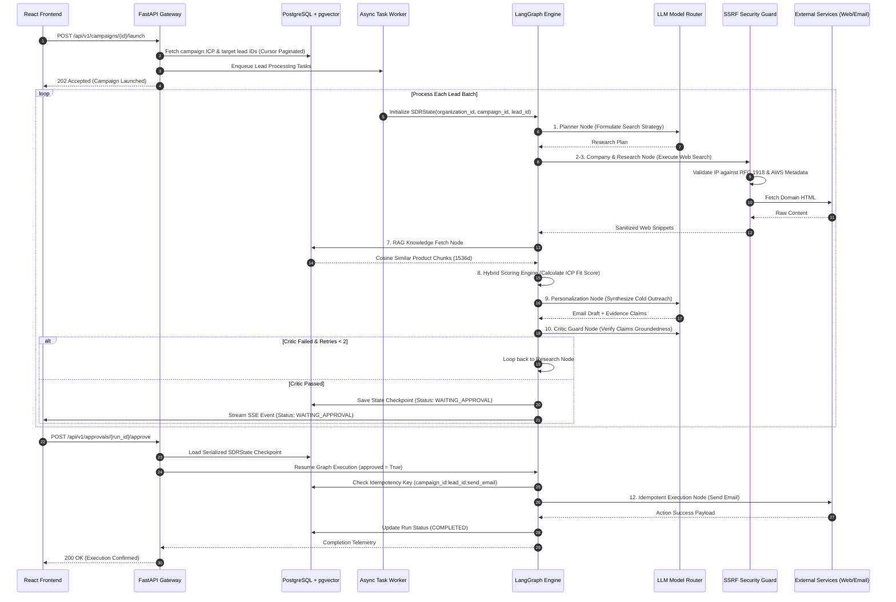

# SignalOS — Technical Architecture, Component Guide & Agentic Workflows

**Document Version**: 2.5.0  
**Target Audience**: Systems Architects, AI Engineers, Enterprise Security Officers, GTM Operations Leads  
**Classification**: Technical Design Document (TDD) & System Architecture Specification  

---

## 1. Executive Architecture Overview

**SignalOS** is an enterprise-grade autonomous Go-To-Market (GTM) agent platform engineered to automate high-intent B2B prospect discovery, signal extraction, RAG-grounded copy synthesis, and deterministic outreach execution. 

Unlike primitive prompt wrappers or unbounded autonomous agent loops, SignalOS utilizes a **stateful, typed, cyclic computational graph** orchestrated via LangGraph, backed by multi-tenant PostgreSQL 16 + `pgvector`, Redis distributed coordination, SSRF-safe tool execution, multi-provider LLM fallback routing, and strict Human-in-the-Loop (HITL) approval gates.

```
┌────────────────────────────────────────────────────────────────────────────────────────────────────────┐
│                                       SignalOS System Topology                                        │
└────────────────────────────────────────────────────────────────────────────────────────────────────────┘

    [ React 18 + TS Web UI ] ───(REST / SSE)───> [ Application Ingress / Load Balancer ]
                                                            │
                                                            ▼
                                              [ FastAPI Gateway (Async API) ]
                                                            │
                      ┌─────────────────────────────────────┼─────────────────────────────────────┐
                      ▼                                     ▼                                     ▼
       [ PostgreSQL 16 + pgvector ]                 [ Redis 7 Cluster ]                  [ Task Queue Workers ]
       • Multi-tenant Data Models                   • Distributed Locks                   • Campaign Batch Engine
       • HNSW Cosine Index (1536d)                  • Real-Time SSE Pub/Sub               • 10M Lead Paginator
       • Checkpoints & Audit Logs                   • API Rate Limiting                   • Concurrency Control
                                                            │
                                                            ▼
                                               [ LangGraph Engine ]
                                                            │
           ┌────────────────────────────────────────────────┼────────────────────────────────────────────────┐
           ▼                                                ▼                                                ▼
   ┌───────────────┐                              ┌───────────────────┐                            ┌───────────────────┐
   │ Research &    │                              │ Intelligence &    │                            │ Security &        │
   │ Extraction    │                              │ Knowledge Base    │                            │ Governance        │
   │ ───────────── │                              │ ───────────────── │                            │ ───────────────── │
   │ • Web Search  │                              │ • pgvector RAG    │                            │ • SSRF Protection │
   │ • Page Scraper│                              │ • Hybrid Scoring  │                            │ • Critic Guard    │
   │ • CRM Tool    │                              │ • LLM Model Router│                            │ • HITL Approval   │
   └───────────────┘                              └───────────────────┘                            └───────────────────┘
```

> [!IMPORTANT]
> **Core Architectural Guarantee**: No external side effect (e.g., outreach email or CRM mutation) is ever executed without passing both an automated zero-hallucination Critic node **and** an explicit Human-in-the-Loop approval gate guarded by idempotent transaction keys.

---

## 2. Multi-Tier Subsystem Breakdown

SignalOS is organized into 7 decoupled architectural subsystems:

```
┌────────────────────────────────────────────────────────────────────────────────────────────────────────┐
│ 1. PRESENTATION & CLIENT TIER                                                                          │
│    • React 18 + TypeScript + Vite Single Page Application                                             │
│    • Real-Time SSE Streamer (Server-Sent Events for live graph trace & token consumption)              │
│    • Interactive DAG Visualizer & Human Approval Command Hub                                          │
└────────────────────────────────────────────────────────────────────────────────────────────────────────┘
                                                   │ REST / SSE
                                                   ▼
┌────────────────────────────────────────────────────────────────────────────────────────────────────────┐
│ 2. API GATEWAY & CONTROL PLANE                                                                         │
│    • FastAPI Async Engine (Python 3.11+, asyncpg, Pydantic v2)                                         │
│    • Correlation Context Tracking (`X-Request-ID` bound to `structlog` contextvars)                    │
│    • Tenant Isolation Middleware & Role-Based Access Control (RBAC)                                    │
└────────────────────────────────────────────────────────────────────────────────────────────────────────┘
                                                   │
          ┌────────────────────────────────────────┴────────────────────────────────────────┐
          ▼                                                                                 ▼
┌────────────────────────────────────────┐                       ┌────────────────────────────────────────┐
│ 3. PERSISTENCE & VECTOR TIER           │                       │ 4. BATCH WORKER & EXECUTION TIER        │
│    • PostgreSQL 16 (Relational schemas)│                       │    • Redis Queue Task Dispatchers       │
│    • pgvector (HNSW 1536d Cosine Search)│                       │    • Cursor-based 10M Lead Paginator  │
│    • Redis 7 (Distributed locks/state) │                       │    • Concurrency & Backpressure Guards │
└────────────────────────────────────────┘                       └────────────────────────────────────────┘
                                                                                    │
                                                                                    ▼
┌────────────────────────────────────────────────────────────────────────────────────────────────────────┐
│ 5. AGENT REASONING ENGINE (LangGraph Stateful Engine)                                                 │
│    • Strongly Typed Graph Context (`SDRState`)                                                         │
│    • Cyclic State Topology with Automated Self-Correction Loops                                        │
│    • Zero-Hallucination Critic Guardrail & Evidence Grounding Verifier                                 │
│    • Human-in-the-Loop State Serialization & Pause/Resume Interruption Handlers                        │
└────────────────────────────────────────────────────────────────────────────────────────────────────────┘
                                                   │
          ┌────────────────────────────────────────┴────────────────────────────────────────┐
          ▼                                                                                 ▼
┌────────────────────────────────────────┐                       ┌────────────────────────────────────────┐
│ 6. TOOL REGISTRY & SECURITY GUARD      │                       │ 7. MULTI-PROVIDER LLM ROUTER           │
│    • SSRF Socket Guard (RFC 1918 / AWS)│                       │    • Dynamic Model Routing Dispatcher  │
│    • Prompt Injection Sanitizer        │                       │    • Automated Provider Fallback Chain │
│    • Idempotent Action Executor        │                       │    • Real-Time Token & USD Cost Ledger │
└────────────────────────────────────────┘                       └────────────────────────────────────────┘
```

---

## 3. Deep-Dive Component Explanations

### 3.1. API Gateway & Ingress Control Plane (`backend/app/api/`)
* **Technology**: FastAPI, `asyncpg`, Pydantic v2, `structlog`.
* **Purpose**: Provides high-throughput, non-blocking asynchronous REST and real-time Server-Sent Events (SSE) interfaces.
* **Key Capabilities**:
  * **Correlation Tracing**: Injects a unique `X-Request-ID` into every inbound request context via middleware, ensuring end-to-end trace logging across API handlers, database queries, background workers, and LLM calls.
  * **Tenant Boundary Isolation**: Enforces tenant authorization tokens, extracting `organization_id` and injecting strict row-level security constraints into database sessions.
  * **Unified Exception Schema**: Catches and translates domain errors (`AppError`, `SecurityError`, `ValidationError`) into uniform JSON responses.

### 3.2. Relational Data & Vector Storage (`backend/app/db/`)
* **Technology**: PostgreSQL 16 + `pgvector` extension, SQLAlchemy 2.0 (Async).
* **Unified Architectural Model**: Combines standard enterprise relational schemas with vector similarity search inside a single PostgreSQL database instance to eliminate multi-database sync lag and consistency issues.
* **Entity Architecture**:
  * `organizations` & `users`: Multi-tenant ownership and RBAC permissions.
  * `companies` & `contacts`: Verified firmographic entities and persona details.
  * `campaigns` & `campaign_leads`: ICP definitions, outbound targets, and state flags.
  * `agent_runs` & `tool_calls`: Granular execution logs, state checkpoints, token metrics, and latency history.
  * `knowledge_documents` & `document_chunks`: Product battlecards and value proposition vectors indexed using HNSW Cosine distance (`vector_cosine_ops`, 1536 dimensions).

### 3.3. Multi-Provider LLM Router & Cost Engine (`backend/app/llm/`)
* **Technology**: Custom abstraction layer unifying OpenAI (`gpt-4o`, `gpt-4o-mini`), Anthropic (`claude-3-5-sonnet`), Google Gemini (`gemini-1.5-pro`), and a deterministic `MockProvider` for CI/CD testing.
* **Key Features**:
  * **Dynamic Model Selection**: Directs cheap web extraction and summary tasks to fast/affordable models (`gpt-4o-mini`) while reserving flagship models (`gpt-4o` / `claude-3-5-sonnet`) for reasoning, qualitative scoring, copy synthesis, and critic verification.
  * **Automated Multi-Provider Fallback**: If a primary LLM vendor returns an HTTP 429 (Rate Limit), HTTP 5xx (Internal Server Error), or timeout, the router instantly fails over along a predefined chain:
    $$\text{OpenAI} \longrightarrow \text{Anthropic} \longrightarrow \text{Gemini} \longrightarrow \text{Mock Provider (Safe Degradation)}$$
  * **Exact USD Cost & Token Ledger**: Tracks exact prompt tokens, completion tokens, and dollar costs per invocation using real-time pricing tables.

### 3.4. Safe Tool Registry & Security Perimeter (`backend/app/agents/tools/`)
* **In-Memory SSRF Protection (`fetch_page.py`)**:
  * Prevents Server-Side Request Forgery by intercepting raw domain URLs and performing host-to-IP resolution *before* opening TCP sockets.
  * Rejects connection attempts to RFC 1918 private subnets (`10.0.0.0/8`, `172.16.0.0/12`, `192.168.0.0/16`), loopbacks (`127.0.0.0/8`), link-local ranges (`169.254.0.0/16`), and AWS EC2 Instance Metadata service endpoints (`169.254.169.254`).
  * Enforces protocol whitelisting (permitting `http://` and `https://` only, blocking `file://`, `gopher://`, `ftp://`).
* **Prompt Injection Defense**:
  * Cleans fetched web payloads by stripping JavaScript, CSS styling, hidden DOM nodes, iframe elements, and prompt override patterns.
* **Idempotent Action Dispatcher (`action_service.py`)**:
  * Guarantees that external side effects (`send_email`, `crm_update`) are executed exactly once per unique action instance.
  * Formulates a deterministic idempotency key:
    $$\text{Idempotency Key} = \text{campaign\_id} : \text{lead\_id} : \text{action\_type}$$
  * Relies on a PostgreSQL unique database index (`idempotency_key`). Retries or duplicate worker jobs matching an existing key return the saved execution result without repeating side effects.

### 3.5. Batch Orchestration & Scale Engine (`backend/app/workers/`)
* **Throughput Goal**: Processes campaigns containing up to 10,000,000 leads without memory degradation or connection pool exhaustion.
* **Mechanisms**:
  * **Cursor-Based Database Pagination**: Replaces high-offset SQL queries (`OFFSET 500000`) with indexed primary key cursor bounds (`WHERE id > :last_id ORDER BY id ASC LIMIT 500`).
  * **Worker Queue Manager**: Dispatches campaign processing tasks to Redis queues managed by async worker pools.
  * **Backpressure Throttling**: Monitors LLM token bucket rates and dynamically pauses task dispatching when rate limit windows approach capacity.

---

## 4. Agentic Workflows & LangGraph State Machine

SignalOS models agent execution as a stateful, cyclic computational graph via **LangGraph**. Graph state is encapsulated within an explicit TypeScript/Python data structure called `SDRState`.

```
                                  [ START ]
                                      │
                                      ▼
                                [ 1. Planner ]
                                      │
                                      ▼
                           [ 2. Company Discovery ]
                                      │
                                      ▼
                               [ 3. Research ] ◄─────────────────────────────────┐
                                      │                                          │
                                      ▼                                          │ (Critic Failed &
                           [ 4. Contact Discovery ]                              │  Retries < 2)
                                      │                                          │
                                      ▼                                          │
                              [ 5. Enrichment ]                                  │
                                      │                                          │
                                      ▼                                          │
                           [ 6. Signal Detection ]                               │
                                      │                                          │
                                      ▼                                          │
                           [ 7. RAG Knowledge Fetch ]                            │
                                      │                                          │
                                      ▼                                          │
                             [ 8. Hybrid Scoring ]                               │
                                      │                                          │
                                      ▼                                          │
                            [ 9. Personalization ]                               │
                                      │                                          │
                                      ▼                                          │
                              [ 10. Critic Guard ] ──────────────────────────────┘
                                      │
                                      ▼ (Critic Passed OR Retries >= 2)
                             [ 11. Human Approval ]
                                      │
                     ┌────────────────┴────────────────┐
                     │ (Approved == True)              │ (Approved == False)
                     ▼                                 ▼
           [ 12. Idempotent Execution ]             [ END ]
                     │
                     ▼
                  [ END ]
```

### 4.1. The Typed Graph Context (`SDRState`)

```python
class SDRState(TypedDict, total=False):
    # Context Identifiers
    organization_id: str
    campaign_id: str
    lead_id: str
    agent_run_id: str
    objective: str

    # Target Entities
    company: Dict[str, Any]
    contact: Dict[str, Any]
    icp: Dict[str, Any]

    # Research & Signals
    research_plan: Dict[str, Any]
    research: List[Dict[str, Any]]
    signals: List[Dict[str, Any]]
    retrieved_context: List[Dict[str, Any]]

    # Hybrid Qualification
    score: float
    score_reasons: List[str]
    score_confidence: float

    # Copy Synthesis & Evidence Tracking
    email_subject: str
    email_body: str
    evidence_claims: List[Dict[str, Any]]

    # Quality Assurance & Self-Correction
    critic_feedback: str
    critic_passed: bool
    research_iterations: int

    # Safety, Telemetry & Cost
    tool_calls: List[Dict[str, Any]]
    errors: List[Dict[str, Any]]
    step_count: int
    total_tokens: int
    total_cost_usd: float

    # Execution & Human Governance Gates
    requires_human_approval: bool
    approved: bool
    action_executed: bool
    action_result: Dict[str, Any]
```

---

### 4.2. 12-Node Sequential Execution Pipeline

| Step | Node Name | Implementation Purpose | Primary Inputs / Tools | Outputs & State Mutations |
| :--- | :--- | :--- | :--- | :--- |
| **1** | **`planner`** | Formulates target-specific research objectives based on campaign ICP parameters. | `company`, `icp`, `objective` | `research_plan` |
| **2** | **`company_discovery`** | Resolves verified firmographic details, employee ranges, industry match, and domain. | `web_search`, `fetch_page` | `company` (enriched) |
| **3** | **`research`** | Conducts web searches across press releases, engineering blogs, and corporate sites. | `web_search`, `fetch_page` | `research` list, increments `research_iterations` |
| **4** | **`contact_discovery`** | Identifies target decision-maker matching ICP persona profiles (e.g. VP Eng, CTO). | `company`, `icp.target_personas` | `contact` |
| **5** | **`enrichment`** | Verifies prospect tenure, job title, and verified business email addresses. | `crm_tool`, `web_search` | `contact` (enriched) |
| **6** | **`signal_detection`** | Extracts explicit buying triggers: recent funding rounds, engineering hiring spikes, tech migrations. | `research`, `llm_router` | `signals` list with evidence quotes |
| **7** | **`rag_retrieval`** | Fetches relevant pitch angles, product battlecards, and case studies from `pgvector`. | `rag_tool` (cosine similarity) | `retrieved_context` |
| **8** | **`scoring`** | Executes the deterministic + qualitative hybrid lead qualification formula. | `scoring_service.compute_score` | `score`, `score_reasons`, `score_confidence` |
| **9** | **`personalization`** | Synthesizes 1-to-1 cold outreach copy grounded strictly in detected signals and RAG context. | `prompts.personalization_prompt` | `email_subject`, `email_body`, `evidence_claims` |
| **10** | **`critic`** | Audits copy for unsupported assertions, hallucinated statistics, or unverified claims. | Zero-hallucination verifier prompt | `critic_passed`, `critic_feedback` |
| **11** | **`approval`** | Enforces human-in-the-loop policies; serializes graph state and pauses execution if required. | `score`, `requires_human_approval` | `requires_human_approval`, `approved` |
| **12** | **`execution`** | Dispatches outreach email or updates CRM via the idempotent action executor. | `action_service.execute_action` | `action_executed`, `action_result` |

---

### 4.3. Hybrid Qualification Algorithm

SignalOS calculates account fit using a multi-factor hybrid scoring equation:

$$\text{Final Score} = \sum_{i=1}^{4} (w_i \cdot S_i) \times C_{\text{data}}$$

Where:
* **Company Size Fit ($w_1 = 0.30$)**: Strict deterministic match against campaign employee bands.
* **Industry & Tech Match ($w_2 = 0.20$)**: Keyword and semantic overlap between target tech stack and ICP requirements.
* **Persona Seniority Match ($w_3 = 0.20$)**: Title hierarchy score (C-Suite / VP = 100%, Director = 80%, Lead = 50%).
* **Qualitative Buying Signals ($w_4 = 0.30$)**: Buying trigger recency and relevance:
  * Funding round within 90 days: $+30\text{ pts}$
  * Active engineering hiring spike: $+25\text{ pts}$
  * Technology stack migration: $+20\text{ pts}$
* **Data Confidence Multiplier ($C_{\text{data}} \in [0.85, 1.0]$)**: Scaled based on email deliverability status and source freshness.

---

### 4.4. Zero-Hallucination Critic Guardrail

The **Critic Node** acts as an automated quality control layer before any copy can reach a human or external dispatch:

```
                          [ Generated Draft Copy ]
                                     │
                                     ▼
                    [ Critic Verification Engine ]
                     • Extract body claims
                     • Match against state["signals"]
                     • Match against state["retrieved_context"]
                                     │
                    ┌────────────────┴────────────────┐
                    │                                 │
                    ▼ (Claims Supported)              ▼ (Hallucination Detected)
           [ Set critic_passed = True ]      [ Set critic_passed = False ]
                    │                                 │
                    ▼                                 ▼
         [ Advance to Approval ]             [ Route to Research Retry ]
                                             (Iteration Count < 2)
```

1. **Sentence Claims Extraction**: Parses `email_body` into individual factual assertions.
2. **Evidence Mapping**: Every statement (e.g. *"Saw your team recently raised \$15M Series A"*) must match a verbatim citation in `state["signals"]`.
3. **Product Claim Mapping**: Every product feature or customer story cited must match a verified chunk in `state["retrieved_context"]`.
4. **Self-Correction Retry**: If an unverified assertion is detected, the Critic sets `critic_passed = False` with feedback. LangGraph routes control back to the `research` node to find missing proof or rewrite the sentence. Cycle iteration count is bounded (`research_iterations < 2`) to cap cost.

---

### 4.5. Human-in-the-Loop (HITL) Interruption & Approval Flow

Enterprise safety requires deterministic human checkpoints for outreach.

```
       [ Agent Run Reaches Approval Node ]
                       │
                       ▼
       [ LangGraph Checkpoint Serialized ]
        • Run status: WAITING_APPROVAL
        • State saved to PostgreSQL agent_runs
                       │
                       ▼
       [ UI Operator Notification / Stream ]
        • Operator inspects signals, RAG chunks & draft copy
                       │
       ┌───────────────┴───────────────┐
       ▼                               ▼
 [ Operator Approves / Edits ]   [ Operator Rejects ]
       │                               │
       ▼                               ▼
 [ Resume Graph Endpoint ]       [ Run Status: REJECTED ]
  • approved = True               • Graph terminates
  • Save manual copy edits        • Log audit trail
       │
       ▼
 [ Execute Idempotent Action ]
```

---

## 5. Architectural Component Deep Dive Matrix

| Component | 1. Why is it there? | 2. What happens if it fails? | 3. How does it scale? | 4. What alternative could you use? |
| :--- | :--- | :--- | :--- | :--- |
| **FastAPI Ingress Gateway** | Asynchronous, high-throughput REST API gateway with automatic OpenAPI generation and native Python async IO. | Connection pool auto-reconnects; health check fails and ALB routes traffic to healthy task replicas. | Horizontal scaling via ECS / Kubernetes pods behind an Application Load Balancer. | Go (Gin), Node.js (Fastify) |
| **PostgreSQL 16 + pgvector** | Single unified database engine for ACID relational records and HNSW vector similarity search. | Secondary replica auto-promotes; point-in-time recovery via WAL archiving. | Table partitioning by `organization_id`, read replicas, HNSW vector indexing. | Qdrant, Pinecone, Milvus + Postgres |
| **Redis 7 Cluster** | Distributed locks, rate limiting, task queues, and low-latency SSE event streaming. | Data remains persistent in PostgreSQL; rate limiting degrades safely to open state. | Redis Cluster with key sharding and multi-AZ replication. | Memcached, AWS DynamoDB |
| **LangGraph Orchestrator** | Explicit state machines supporting cyclic feedback loops, typed state, and native HITL checkpoints. | Run marked as `FAILED`; state checkpointed in DB allows seamless resumption. | Stateless worker processes execute independent graph runs synced to Redis/DB. | Temporal, AWS Step Functions, CrewAI |
| **Multi-Model LLM Router** | Prevents vendor lock-in, optimizes token spend, and guarantees 99.99% uptime via multi-provider fallbacks. | Auto-cascades down fallback chain: OpenAI $\rightarrow$ Anthropic $\rightarrow$ Gemini $\rightarrow$ Mock. | Asynchronous request multiplexing, client-side token bucket rate queues. | LiteLLM Proxy, Portkey |
| **SSRF Socket Guard** | Prevents prompt-injected or malicious URLs from probing AWS EC2 metadata (`169.254.169.254`) or internal subnets. | Blocked URLs raise `SecurityError`; agent safely degrades to cached search context. | In-memory DNS/IP range evaluation prior to opening TCP socket. | Squid Proxy, AWS Network Firewall |
| **Idempotent Action Executor** | Guarantees zero duplicate outreach emails or double CRM writes upon task retries. | Duplicate executions hit unique DB key constraint `(campaign_id:lead_id:action_type)` and return prior result. | Database B-Tree index lookup on `idempotency_key`. | Redis Distributed Locks + DB Transaction |

---

## 6. End-to-End Data & Execution Sequence

The complete lifecycle of a lead through SignalOS is illustrated below:



---

## 7. Operational Observability & Production Verification

### 7.1. Real-Time Telemetry & SSE Streaming
SignalOS emits fine-grained execution events over Server-Sent Events (`/api/v1/agent-runs/{id}/stream`):
* `step_start`: Node name, input state snapshot.
* `tool_call`: Tool name, sanitized arguments, latency duration in ms.
* `llm_usage`: Model name, prompt tokens, completion tokens, step cost in USD.
* `step_complete`: Output state delta, updated run total cost.
* `state_change`: Graph state transition (`RUNNING` $\rightarrow$ `WAITING_APPROVAL` $\rightarrow$ `COMPLETED`).

### 7.2. Automated Evaluation Benchmark Suite (`backend/app/evaluation/`)
SignalOS includes a continuous evaluation harness (`evaluator.py`) validating model performance against benchmark datasets (`dataset.py`):

| Metric | Target | Evaluation Method |
| :--- | :--- | :--- |
| **Groundedness / Hallucination Rate** | $< 1.0\%$ | Automated Critic verifier evaluates 100% of claims against evidence quotes. |
| **ICP Scoring Accuracy** | $> 95.0\%$ | Benchmark suite compares scoring outputs against ground-truth golden datasets. |
| **SSRF Security Block Rate** | $100.0\%$ | Unit test suite verifies zero private IP / metadata leakages under attack payloads. |
| **P95 Execution Latency** | $< 12.0\text{s}$ | Latency measured across complete 12-node pipeline runs. |
| **Cost Per Enriched Lead** | $< \$0.05$ | Total LLM + tool cost consumption ledger per processed lead. |

---

*SignalOS Architecture & Agent Workflows Specification — Production Ready.*
