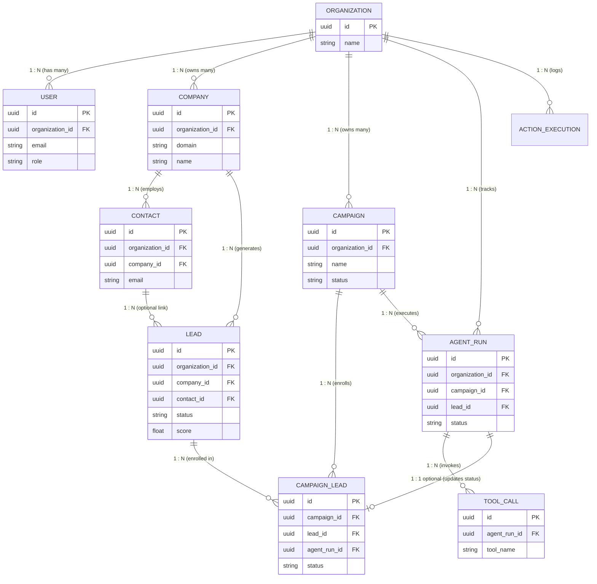

# SignalOS Database Schema & Model Relationships

## 1. Overview & Multi-Tenant Architecture

SignalOS uses a **Multi-Tenant Relational Architecture** powered by PostgreSQL and SQLAlchemy 2.0 Mapped ORM models. 

At the center of the architecture is the **`Organization`** entity. Almost every primary entity (`User`, `Company`, `Contact`, `Lead`, `Campaign`, `AgentRun`, `ActionExecution`) belongs to a single Organization via a `organization_id` foreign key. This ensures:
- **Strict Data Isolation**: Queries filter on `organization_id` to guarantee tenant data privacy.
- **Cascading Deletions**: Deleting an Organization automatically cleans up all associated users, companies, leads, and campaigns using `ondelete="CASCADE"`.

---

## 2. Entity-Relationship Diagram (ERD)



---

## 3. Relationship Types & Mechanics

### 3.1. One-to-Many (1:N) & Many-to-One (N:1)

In a **One-to-Many** relationship, a single parent row is linked to multiple child rows. The **Foreign Key (FK)** always resides on the child table pointing to the parent table's Primary Key.

#### Examples in SignalOS:

1. **`Organization` ➔ `Users`**
   - **Business Logic**: One Organization has many User members.
   - **Parent Model (`Organization`)**: 
     `users: Mapped[List["User"]] = relationship("User", back_populates="organization", cascade="all, delete-orphan")`
   - **Child Model (`User`)**:
     `organization_id: Mapped[uuid.UUID] = mapped_column(ForeignKey("organizations.id", ondelete="CASCADE"))`
     `organization: Mapped["Organization"] = relationship("Organization", back_populates="users")`

2. **`Company` ➔ `Contacts`**
   - **Business Logic**: A targeted B2B Company has multiple Contacts (employees/executives).
   - **Parent Model (`Company`)**:
     `contacts: Mapped[List["Contact"]] = relationship("Contact", back_populates="company", cascade="all, delete-orphan")`
   - **Child Model (`Contact`)**:
     `company_id: Mapped[uuid.UUID] = mapped_column(ForeignKey("companies.id", ondelete="CASCADE"))`
     `company: Mapped["Company"] = relationship("Company", back_populates="contacts")`

3. **`Company` ➔ `Leads`**
   - **Business Logic**: A Company can produce multiple Lead pipeline records.
   - **Child Model (`Lead`)**:
     `company_id: Mapped[uuid.UUID] = mapped_column(ForeignKey("companies.id", ondelete="CASCADE"))`

4. **`AgentRun` ➔ `ToolCalls`**
   - **Business Logic**: A single AI Agent execution run can generate multiple tool calls (e.g., web search, email verification).
   - **Child Model (`ToolCall`)**:
     `agent_run_id: Mapped[uuid.UUID] = mapped_column(ForeignKey("agent_runs.id", ondelete="CASCADE"))`

---

### 3.2. Many-to-Many (N:M) via Association Model

In a **Many-to-Many** relationship, multiple records in Table A relate to multiple records in Table B. In relational databases, this is modeled via a **Junction / Association Table** holding Foreign Keys to both tables.

#### Example in SignalOS: `Campaign` ↔ `Lead` (via `CampaignLead`)

- **Business Logic**:
  - One `Campaign` targets **many `Leads`**.
  - One `Lead` can be enrolled in **many `Campaigns`**.
  - The link carries metadata such as campaign-specific lead status (`NEW`, `QUALIFIED`, `CONTACTED`) and custom score.

- **Association Model (`CampaignLead`)**:
  ```python
  class CampaignLead(Base, UUIDMixin, TimestampMixin):
      __tablename__ = "campaign_leads"

      campaign_id: Mapped[uuid.UUID] = mapped_column(
          UUID(as_uuid=True), ForeignKey("campaigns.id", ondelete="CASCADE"), nullable=False
      )
      lead_id: Mapped[uuid.UUID] = mapped_column(
          UUID(as_uuid=True), ForeignKey("leads.id", ondelete="CASCADE"), nullable=False
      )
      agent_run_id: Mapped[Optional[uuid.UUID]] = mapped_column(
          UUID(as_uuid=True), ForeignKey("agent_runs.id", ondelete="SET NULL"), nullable=True
      )
      status: Mapped[str] = mapped_column(String(50), default="NEW", nullable=False)
      score: Mapped[Optional[float]] = mapped_column(Float, nullable=True)

      campaign: Mapped["Campaign"] = relationship("Campaign", back_populates="campaign_leads")
      lead: Mapped["Lead"] = relationship("Lead", back_populates="campaign_associations")
      agent_run: Mapped[Optional["AgentRun"]] = relationship("AgentRun")

      __table_args__ = (
          UniqueConstraint("campaign_id", "lead_id", name="uq_campaign_leads_campaign_lead"),
      )
  ```

---

### 3.3. Optional / Nullable Foreign Keys (Zero-to-Many)

When a relationship is optional, the Foreign Key column allows `NULL` values and specifies `ondelete="SET NULL"`.

#### Examples in SignalOS:
1. **`Lead` ➔ `Contact`**: A lead is tied to a `Company`, but might not yet have an assigned `Contact`.
   - `contact_id: Mapped[Optional[uuid.UUID]] = mapped_column(ForeignKey("contacts.id", ondelete="SET NULL"), nullable=True)`
2. **`AgentRun` ➔ `Campaign` / `Lead`**: An AI agent run can be executed in standalone mode without a specific campaign or lead.
   - `campaign_id: Mapped[Optional[uuid.UUID]] = mapped_column(ForeignKey("campaigns.id", ondelete="CASCADE"), nullable=True)`
   - `lead_id: Mapped[Optional[uuid.UUID]] = mapped_column(ForeignKey("leads.id", ondelete="SET NULL"), nullable=True)`

---

## 4. Entity Detail Matrix

| Model | Primary Key | Foreign Keys | Key Relationships | Deletion Cascade Behavior |
| :--- | :--- | :--- | :--- | :--- |
| **`Organization`** | `id` (UUID) | *None* | `users`, `companies`, `campaigns` | **Root Entity**. Deletes all child entities on deletion. |
| **`User`** | `id` (UUID) | `organization_id` ➔ `organizations.id` | `organization` | `CASCADE` on Organization deletion. |
| **`Company`** | `id` (UUID) | `organization_id` ➔ `organizations.id` | `organization`, `contacts`, `leads` | `CASCADE` on Org deletion; deletes `contacts` and `leads`. |
| **`Contact`** | `id` (UUID) | `organization_id`, `company_id` | `company`, `leads` | `CASCADE` on Company deletion. |
| **`Lead`** | `id` (UUID) | `organization_id`, `company_id`, `contact_id` | `company`, `contact`, `campaign_associations` | `CASCADE` on Company; `SET NULL` on Contact deletion. |
| **`Campaign`** | `id` (UUID) | `organization_id` ➔ `organizations.id` | `organization`, `campaign_leads`, `agent_runs` | `CASCADE` on Org deletion; deletes `campaign_leads` & `agent_runs`. |
| **`CampaignLead`** | `id` (UUID) | `campaign_id`, `lead_id`, `agent_run_id` | `campaign`, `lead`, `agent_run` | `CASCADE` on Campaign/Lead deletion; `SET NULL` on AgentRun deletion. |
| **`AgentRun`** | `id` (UUID) | `organization_id`, `campaign_id`, `lead_id` | `campaign`, `tool_calls` | `CASCADE` on Campaign deletion; `SET NULL` on Lead deletion. |
| **`ToolCall`** | `id` (UUID) | `agent_run_id` ➔ `agent_runs.id` | `agent_run` | `CASCADE` on AgentRun deletion. |
| **`ActionExecution`**| `id` (UUID) | `organization_id` ➔ `organizations.id` | *None* | `CASCADE` on Organization deletion. |

---

## 5. API Layer (Pydantic Schemas) Representation

In FastAPI, SQLAlchemy ORM models are mapped to Pydantic schemas for data validation and serialization:

1. **ID References (Foreign Key representation)**:
   - Used in `Create` / `Update` request payloads (e.g., `ContactCreate(company_id=uuid, ...)`).
2. **Nested Objects (Relationship representation)**:
   - Used in detailed `Read` response payloads (e.g., `LeadRead` containing `company: CompanyRead` and `contact: Optional[ContactRead]`).
